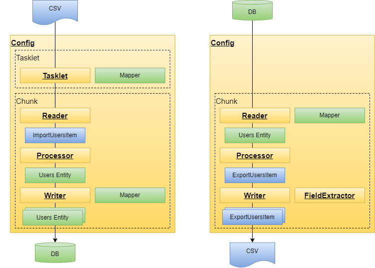

# spring-boot3-batch-train

Spring-Bootでバッチアプリケーション開発トレーニング

## やりたいこと
- 処理方式として、ファイルとDBの入出力に挑戦
  - 入力ファイルのデータをDB登録
  - DB登録されたデータをファイル出力

## ユーザファイルのインポート機能について
- 概要：CSV形式のユーザデータファイルをDBに登録する
  - CSVデータ例：`1001,鈴木 一郎,マーケティング,2023-10-05`
  - 同じファイルを何度でもインポートできるように、最初の処理でテーブルをクリアする
  - 次の処理で、ファイル読み込みを行い、テーブルに登録を行う
- ジョブ名は`importUsersJob`
  - `step1`で、`trancateTasklet`でテーブルのデータを全件クリアする。
  - `step2`のチャンク処理で、ファイル読み込みを行い、テーブルに登録を行う
- チャンク処理
  - `FlatFileItemReader`で、CSVファイルの読み込みを行う。
    - ファイルパス
    - オブジェクトへのマッピング（クラス名ImportUsersItem、項目名）
  - `ItemProcessor`
    - 型変換（`ImportUsersItem`Item ⇒ `Users`エンティティ）
    - データチェック処理：不正データは後続処理に流さず、スキップする
    - データ加工処理
  - `ItemWriter`
    - テーブルへのデータ一括登録(バルクインサート)
    - Writerに渡される引数だけは`List`になっており、複数件の`Users`エンティティが渡ってくる

## ユーザファイルのエクスポート機能について
- 概要：ユーザテーブルのデータをCSV形式で、ファイル出力する
  - CSVデータ例：`1001,鈴木 一郎,マーケティング,2023-10-05`
- ジョブ名は`exportUsersJob`
  - `step1`のチャンク処理で、テーブルデータをselectし、ファイル出力を行う
- チャンク処理
  - `MyBatisCursorItemReaderBuilder`
    - マッパーを設定するだけ
  - `ItemProcessor`
    - 型変換（`Users`エンティティ ⇒ `ImportUsersItem`Item）
  - `FlatFileItemWriter`
    - ファイル形式の各種設定を行う
      - `encoding`：ファイルエンコーディング指定
      - `name`：Writerに付ける名称
      - `saveState`：再処理を行う場合に、処理済みレコードを記憶し、未処理レコードから処理を再開する
      - `resource`：出力ファイルのパス
      - `lineSeparator`：改行コード
      - `shouldDeleteIfEmpty`：出力したファイルが空ファイルの場合、ファイルを削除する
      - `delimited`：区切り文字を使用する
      - `delimiter`：区切り文字
      - `fieldExtractor`：ファイル出力項目を設定する
      - etc

## 前提環境

以下がインストール済みであること
* JDK 17
* git

## 使用するフレームワーク

* spring-boot3.4
* spring-boot-starter-batch
* mybatis
* lombok
* 組み込みh2データベース
* 組み込みMaven 3

## ディレクトリ階層

今回、作成するアプリケーションのディレクトリ階層
```
C:.
│  .gitattributes
│  .gitignore
│  app.drawio
│  app.png
│  card.drawio
│  card.png
│  initializr.png
│  mvnw
│  mvnw.cmd
│  net.drawio
│  net.png
│  pom.xml
│  README.md
│  shopping.drawio
│  shopping.png
├─.mvn
│  └─wrapper
│          maven-wrapper.properties
├─h2db
│      .gitkeep
│      h2-2.3.232.jar
│      testdb.mv.db    ※alwaysモードで一度動かすと生成される
│      testdb.trace.db ※alwaysモードで一度動かすと生成される
├─input-data
│      user.csv
├─output-data
│      .gitkeep
│      users.csv
├─src
│  ├─main
│  │  ├─java
│  │  │  └─com
│  │  │      └─example
│  │  │          └─demo
│  │  │              │  DemoApplication.java
│  │  │              ├─batch
│  │  │              │  ├─card
│  │  │              │  │      .gitkeep
│  │  │              │  ├─net
│  │  │              │  │      .gitkeep
│  │  │              │  ├─sample
│  │  │              │  │  └─master
│  │  │              │  │      └─user
│  │  │              │  │          ├─receive
│  │  │              │  │          │      ImportUsersConfig.java
│  │  │              │  │          │      ImportUsersItem.java
│  │  │              │  │          │      ImportUsersProcessor.java
│  │  │              │  │          │      ImportUsersWriter.java
│  │  │              │  │          └─send
│  │  │              │  │                  ExportUsersConfig.java
│  │  │              │  │                  ExportUsersFieldExtractor.java
│  │  │              │  │                  ExportUsersItem.java
│  │  │              │  │                  ExportUsersProcessor.java
│  │  │              │  └─shopping
│  │  │              │          .gitkeep
│  │  │              │
│  │  │              ├─common
│  │  │              │  ├─entity
│  │  │              │  │      Users.java
│  │  │              │  └─mapper
│  │  │              │          UsersMapper.java
│  │  │              └─core
│  │  │                  ├─config
│  │  │                  │      BatchConfiguration.java
│  │  │                  │      BatchExitCodeGenerator.java
│  │  │                  │
│  │  │                  ├─exception
│  │  │                  │      CustomSkipPolicy.java
│  │  │                  │      SkipException.java
│  │  │                  │
│  │  │                  └─listener
│  │  │                          LogChunkListener.java
│  │  │                          LogJobListener.java
│  │  │
│  │  └─resources
│  │          application.properties
│  │          schema-all.sql
```

## アプリケーションの構造


- Tacklet処理
  - 単発処理を行う方式
  - 例えばファイルをインポートする前に、テーブルを空にするコマンド実行など。
- Chunk処理
  - レコード単位で処理する方式
  - Readerで、1行ずつデータを読み込み、Processerに渡す。
    - ファイルReader
    - DBレコードReader
  - Processerでは、1行ずつデータ加工を行う。ここでは入力データや出力データにはアクセスしない。
    - 単一プロセッサー
    - 複数プロセッサーは、いくつかの単一プロセッサーを束ねて設定できる
  - Writerでは、複数行を受け取り、一括で書き込みを行う。
    - ファイルWriter
    - DBレコードWriter
- Configは上記を取りまとめる設定クラス。ジョブやステップの制御も行う。
- 実行
  - ジョブ
    - 複数のステップを制御して、実行する
  - ステップ
    - TaskletやChunkの実行設定を行い、実行する

## 準備 githubからソースコードを取得

gitを使ってソースコードをダウンロードする
```
コマンドプロンプトで実行
git clone https://github.com/namickey/spring-boot3-batch-train.git
cd spring-boot3-batch-train
```

## 準備：テーブル作成

1.application.propertiesの初期化設定を`always`に変える。  
`schema-all.sql`を使った初期化が`ON`になる。
```
データベース初期化用DDL実行モード（ALWAYS、EMBEDDED、NEVER）
spring.sql.init.mode=always
```

2.コマンドプロンプトで実行し、`schema-all.sql`を一度だけ実行しテーブル作成を行う。
```shell
インポート
mvnw.cmd spring-boot:run -Dspring-boot.run.arguments="--spring.batch.job.name=importUsersJob"
```

3.application.propertiesの初期化設定を`never`に戻す。  
`schema-all.sql`を使った初期化は`OFF`になる。
```
データベース初期化用DDL実行モード（ALWAYS、EMBEDDED、NEVER）
spring.sql.init.mode=never
```

※`schema-all.sql`のcreate table文を修正した場合には、再度、上記手順を実施すること。

## 実行 spring-boot:run

実行する
```shell
コマンドプロンプトで実行

インポート
mvnw.cmd spring-boot:run -Dspring-boot.run.arguments="--spring.batch.job.name=importUsersJob"

エクスポート
mvnw.cmd spring-boot:run -Dspring-boot.run.arguments="--spring.batch.job.name=exportUsersJob"
```

## H2DBのデータ確認
```shell
H2DBサーバの起動
java -jar h2db/h2-2.3.232.jar

DB接続
http://localhost:8082/login.jsp

保存済設定：Generic H2(Server)
JDBC URL：jdbc:h2:./h2db/testdb;AUTO_SERVER=TRUE
ユーザ名：sa
パスワード：
```

## その他の機能

### リスナー
- 概要
  - ジョブやステップの前後や例外発生時に呼び出される処理をジョブリスナー、ステップリスナーとして登録することができる。
- `LogJobListener`は、ジョブ終了後に呼び出されるログ出力処理。
```log
出力イメージ
2025-04-06T20:00:30.413+09:00  INFO 10312 --- [           main] c.e.demo.core.listener.LogJobListener    : AfterJob:input=28, skip=0
```
- `LogChunkListener`は、チャンク終了後に呼び出されるログ出力処理。
```log
出力イメージ
2025-04-06T20:00:30.378+09:00  INFO 10312 --- [           main] c.e.demo.core.listener.LogChunkListener  : AfterChunk:input=10, skip=0, commit=1
2025-04-06T20:00:30.392+09:00  INFO 10312 --- [           main] c.e.demo.core.listener.LogChunkListener  : AfterChunk:input=20, skip=0, commit=2
2025-04-06T20:00:30.402+09:00  INFO 10312 --- [           main] c.e.demo.core.listener.LogChunkListener  : AfterChunk:input=28, skip=0, commit=3
```
### 後続処理のスキップ
- 概要
  - 入力レコード（ファイルなど）で、不正データが読み込まれた場合など、後続処理（Writer等）にそのレコードを受け渡したくない場合、そのレコードをスキップさせる。
  - 入力件数が`10件`で、正常データが`9件`、不正データが`1件`で、Processor処理でスキップした時、後続Writerには`9件`が受け渡される。
- 実現方法
  - `SkipException`を、レコードを不正データとする場合には、スローする。
  - `CustomSkipPolicy`に、スキップ扱いとする例外クラスを登録する。
### 終了コード
- 概要、背景
  - Spring-Bootのバッチでは正常終了でも、異常終了でも、デフォルトの挙動では、終了コードが正常`0`で返却される。
  - ジョブスケジューラやシェル等を使って実行制御を行う場合には、終了コードを切り替えること（正常`0`、異常`1`）が必要
- 実現方法
  - `BatchExitCodeGenerator`で、ステップ処理が異常終了した場合には、終了コードを異常`1`を返却する
  - `BatchConfiguration`で、`終了コードジェネレータ`に上記クラスを登録する

## やってみよう 

### 1. `Spring Initializr`から初期構成のアプリケーションをダウンロードする  
https://start.spring.io/


### 2. 統合開発環境としてVSCodeを使って、今動かしたソースコードと同じものを実装し、動作確認する
> [!TIP]
> 統合開発環境としてVSCodeを使おう  

### 3. 自分のgithubアカウントを作って、作ったソースを公開しよう

### 4. GitHub Copilotを使ってみよう

> [!TIP]
> VS CodeでGitHub Copilot 無料版の導入　備忘録  
> https://zenn.dev/yuta_haruna/articles/fb809e68e6bae5  
> 
> GitHub Copilot を完全に使いこなす会  
> https://zenn.dev/microsoft/articles/github_copilot_intro  

### 5. 業務例に従って、バッチアプリケーションを作成しよう
- 業務例１　光回線
- 業務例２　ショッピング
- 業務例３　クレジットカード

## 業務例１　光回線


## 業務例２　ショッピング


## 業務例３　クレジットカード


## 参考

> [!TIP]
> ｢全銀システム」と「日銀ネット」は具体的にどうやって連携しているか ー「為替」とは何か？  
> https://kenji-takahasi.hatenablog.com/entry/zengin_system_nitigin_net  
> 
> 全銀ネット・全銀システムと日銀ネットの仕組みを説明  
> https://elite-lane.com/bank-of-bank/  
> 
> 「口座振替」と「口座振込」の違いとは？それぞれのメリットや手数料の違いを解説　　
> https://ja.komoju.com/blog/bank-settlements/account-transfer-types/　　
> 
> 「口座振替」とは？事業者が知っておくべき仕組みとメリット・デメリットを解説  
> https://www.smartwork.nekonet.co.jp/media/column/paperless06  
> 
> 『全銀フォーマット』とは？FB（ファームバンキング）の解説  
> https://mirukognosis.com/?p=1822  
> 
> 《口座振替・代金回収》振替結果ファイル・フォーマット（全銀協規定形式）  
> https://www.kiraboshibank.co.jp/file.jsp?id=6329  
> 
> 全銀ファイルフォーマット 口座振替  
> https://www.hokutobank.co.jp/corporation/houzinib/pdf/zengin_kofuri.pdf  
> 
> 口座振替依頼書  
> https://www.omegas.co.jp/gas/living/plan/payment#link-01  


## 参考

※2025年3月時点

| 分類          | 名称                        | 無料プラン | 料金      | AIモデル料金         |
| ----------- | ------------------------- | ----- | ------- | --------------- |
| アシスタント      | GitHub Copilot            | 有り    | $10     |                 |
|             | AWS CodeWhisperer         | 有り    | $19     |                 |
|             | Gemini Code Assist        | 有り    | $19     |                 |
|             | Cursor                    | 有り    | $20、$40 | -               |
|             | Windsurf                  |       |         |                 |
|             | Tabnine                   |       |         |                 |
| エージェント      | Cline                     | -     | 無料      | 別途必須。※Gemini無料枠 |
|             | Claude Code               | 有り    | $20、$30 | 別途必須。※無料モデル有り   |
|             | Devin                     |       |         |                 |
|             | Replit Agent              |       |         |                 |
|             | GitHub Copilot Agent Mode |       |         |                 |

